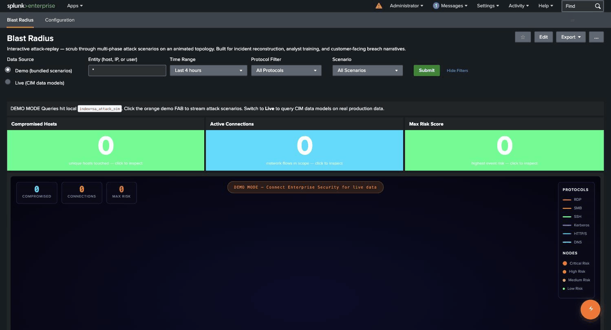

# SA-attack-replay — Blast Radius

A Splunk Enterprise dashboard that reconstructs multi-phase attack scenarios on an animated topology with DVR-style scrubbing. Submitted to the Splunk Community Dashboard Contest 2026.

Author: Steve Koelpin (`@skoelpin`), DataDay Technology Solutions.
License: Apache 2.0.


*Click the orange demo FAB, pick a scenario, hit Stream — ~10 seconds later 80 CIM-tagged events land in `index=sa_attack_sim` and every panel populates.*

---

## 30-second tour

1. Install the app, restart Splunk, navigate to **Apps → Attack Replay → Blast Radius**.
2. Click the **orange demo FAB** (bottom-right). Pick a scenario (APT, Ransomware, Insider Threat). Click **STREAM SCENARIO**. ~10 seconds later: 80 CIM-tagged events land in `index=sa_attack_sim`.
3. Click **Submit** on the dashboard filter row. All 12+ panels populate.
4. The hero topology animates the attack chain phase-by-phase. Watch the **DVR timeline scrubber** below it — drag the playhead to any moment, speed 0.5x/1x/2x/4x.
5. Each phase fires a **banner overlay** (e.g. "INITIAL ACCESS") plus **attacker thought-bubbles** narrating intent in the attacker's own voice.
6. Below the hero: SOC Q&A row, MITRE tactic donut, host-impact treemap, recommended actions IR playbook (loaded from `lookups/ar_recommendations.csv`), auto-generated incident narrative.
7. Check the **Detection Coverage Score** KPI (a single 0–100 posture number) and the **MITRE ATT&CK Detection Coverage by Tactic** table — both populate in Demo mode and show, per tactic, exactly which observed techniques have no bundled detection.
8. Want real data? Point the **Entity filter** at a real host and switch to **Live mode** — the same dashboard runs against your CIM-tagged production data and surfaces the **DETECTION GAP** matrix, flagging which observed techniques have no correlation search to catch them.

That's the whole loop. No external apps required.

## Why it's different

Most security dashboards summarize past data. Blast Radius **replays the attack in motion** so a viewer can see the kill chain unfold the way the attacker experienced it — a teaching, storytelling, and post-mortem tool that doubles as a live monitor when pointed at real CIM data.

## Judging-criteria map

| Criterion | Weight | Where to look |
|---|---|---|
| **Technical depth** | 30% | `default/macros.conf` — 33 macros incl. `streamstats` velocity, `cluster` lateral-signature, `eventstats` blast-share, summary fallback. `default/data/models/*.json` — bundled CIM data models so Live mode works without `Splunk_SA_CIM`. `appserver/static/js/ar_blast.js` — 2,000-line custom SVG topology + DVR engine. `default/savedsearches.conf` — 7 ES-style correlation searches mapped to MITRE techniques. |
| **Originality** | 30% | DVR-scrubbed attack replay is novel for Splunk. Attacker thought-bubbles fire at `_time_offset` boundaries from each scenario. Auto-narrate panel generates an incident summary from the streamed events. 3 distinct scenarios (APT-29 espionage, ransomware, insider data theft) cover the three most-asked customer breach narratives. |
| **Practical** | 15% | Same dashboard works against bundled demo data **or** real CIM-tagged production data — single dashboard, one token toggle. Recommended Actions panel is a real lookup-driven IR playbook (18 graded entries × 3 scenarios). 7 bundled saved searches would actually detect each scenario when enabled. Click any KPI single → drilldown to filtered raw events. |
| **Visual** | 15% | Cyberpunk + Bloomberg-terminal aesthetic, custom dark theme, CSS animations for phase transitions, color-coded protocol legend, gradient KPI tiles, theme-aware MITRE donut, SVG topology with risk-tier node coloring. |
| **Description** | 10% | This README + `CHANGELOG.md`. Inline comments on every macro and JS module. |

## What it is

A single Splunk Classic Simple XML dashboard (`blast_radius`) plus a companion configuration dashboard (`configuration`). The primary dashboard renders an animated SVG topology of an attack chain, with KPIs, a kill-chain timeline chart, a notable events table, MITRE ATT&CK tactic breakdown, and a per-scenario incident response playbook.

The dashboard is built for incident reconstruction, analyst training, and customer-facing breach narratives. It is not intended for Tier 1 alert triage.

## Architecture

### Data layer

Demo data is written into `index=sa_attack_sim` with field-preserved native sourcetypes (`WinEventLog:Security`, `WinEventLog:Sysmon`, `stream:http`, `stream:mysql`, `stream:dns`, `linux:auth`, `MSExchange:Management`). The data generator (`ar_streamer.js`) groups events per sourcetype and issues separate `| collect index=sa_attack_sim sourcetype=<X>` searches so each event keeps its native sourcetype at index time.

### CIM compliance without external add-ons

`tags.conf` + `eventtypes.conf` + `props.conf` tag each event into the standard CIM data models (`Authentication`, `Network_Traffic.All_Traffic`, `Endpoint.Processes`, `Endpoint.Filesystem`, `Web`, `Malware`, `Email`, `Change`). The app ships with its own minimal `Authentication`, `Network_Traffic`, and `Endpoint` data model definitions (`default/data/models/*.json`), so Live mode works without the external `Splunk_SA_CIM` app installed. If `Splunk_SA_CIM` is installed, its definitions take precedence.

Example: after streaming, `| tstats summariesonly=false count from datamodel=Authentication.Authentication` returns the bundled events because they're tagged `authentication`.

### Search layer

Dashboard panels are powered by 33 search macros in `default/macros.conf` (demo panel macros, three KPI macros with demo/live variants, the shared `ar_demo_base` post-process root, the detection-coverage scoring macros, plus a dedicated set of `ar_live_*` Live-mode macros). Three KPI macros have demo and live variants:

```
[ar_compromised_count_demo(2)]
args = entity, scenario
definition = search index=sa_attack_sim `ar_entity_filter($entity$)` \
    `ar_scenario_filter($scenario$)` | stats dc(orig_host) AS count

[ar_compromised_count_live(2)]
args = entity, scenario
definition = | tstats summariesonly=false dc(Authentication.dest) AS count \
    FROM datamodel=Authentication.Authentication \
    WHERE Authentication.action="success" AND \
    (Authentication.dest="$entity$" OR Authentication.user="$entity$" OR "$entity$"="*")
```

The dashboard uses token substitution (`$macro_compromised$`) so panels switch between demo and live macros at runtime without duplicate panels.

### Shared base-search architecture

The 8 demo analysis panels post-process **one** shared base search (`ar_demo_base`) instead of each dispatching its own `index=sa_attack_sim` job. This is standard Splunk dashboard best practice — the demo dashboard runs 1 base job + 8 lightweight post-process children instead of 8 independent searches. Each post-process chain was CLI-verified to produce output identical to the original standalone macro.

### Detection Coverage Score

Demo mode quantifies the detection-gap posture rather than just listing gaps:

- **Detection Coverage Score** — a single 0–100 KPI ("% of observed techniques with a bundled detection"), color-blocked red/amber/green.
- **Undetected High-Risk Techniques** — a KPI counting techniques with `risk_score >= 70` and no detection.
- **MITRE ATT&CK Detection Coverage by Tactic** — a per-tactic table showing coverage %, techniques observed, gap count, and max risk, sorted worst-first with heat-mapped formatting. Turns the passive detection-gap table into a glanceable, quantified risk-posture view. All three run as post-process children of `ar_demo_base`.

### Critical-event "Red Alert" topology pulse

When a node with `risk >= 95` lands during replay, the topology fires a crimson "Red Alert" pulse — a visual flash that draws the eye to the most critical moment of the kill chain as it unfolds.

### Saved correlation searches

`savedsearches.conf` ships 7 disabled-by-default correlation searches with `action.notable = 1` and `action.risk = 1`, mapped to MITRE techniques. They are working examples of detections that would fire on the bundled demo data when enabled.

### Live Mode

Point the Entity filter at a real host and toggle to Live mode and the same dashboard runs against your CIM-tagged production data instead of the bundled scenarios. Live mode adds analyst-facing capabilities on top of the topology replay:

- **MITRE ATT&CK detection-gap matrix** — for each technique observed on real CIM data, the matrix shows whether a correlation/notable search exists that would fire on it, flagging **DETECTION GAP** wherever coverage is missing. It tells a SOC manager exactly which detections are absent for the attack patterns actually happening in their environment.
- **Export Briefing (PDF)** — one-click, browser-native PDF of the current investigation via `window.print()` + a dedicated print stylesheet (Splunk chrome stripped, paper-friendly tables, frozen topology snapshot). No external libraries (no jsPDF / html2canvas).
- **Copy Link (deep link)** — copies a URL encoding the entity, time range, mode, scenario **and** the exact playhead offset (`?t=NN`), so an analyst can share the precise moment of an investigation — the topology re-seeks to that offset on load.

### Visualization layer

`ar_blast.js` (~2,000 lines) is a custom SVG topology renderer. On dashboard load it calls `DemoStreamer.getScenario(activeScenarioId)`, walks the scenario's phases, and builds a node/edge timeline. Each phase's events become a timeline step that adds nodes and edges to the SVG when the playhead crosses the phase boundary.

The DVR controls (rewind, play/pause, step, speed) drive `requestAnimationFrame`-paced playback. The playback duration auto-scales to each scenario's `target_playback_seconds: 90` so all three scenarios play through in approximately 90 seconds at 1x.

Phase-transition banner overlays and attacker thought-bubble annotations fire at `_time_offset` boundaries defined on each scenario's phases.

## Bundled scenarios

| Code              | Name                       | Phases | Events | TTPs (MITRE) |
|-------------------|----------------------------|--------|--------|--------------|
| op_midnight_eclipse | Operation Midnight Eclipse | 6      | 80     | T1204.002, T1059.001, T1071.001, T1003.001, T1021.002, T1003.006, T1558.001, T1041 |
| op_ironclaw       | Operation Ironclaw         | 5      | 64     | T1566.001, T1486, T1490, T1489, T1083, T1059, T1071 |
| op_silent_drift   | Operation Silent Drift     | 4      | 50     | T1078, T1083, T1213, T1052, T1567, T1567.002 |

Total: 194 synthesized events.

## Install

1. Drop the tarball under `$SPLUNK_HOME/etc/apps/` and extract.
2. Restart Splunk.
3. Navigate to `Apps > Attack Replay > Blast Radius`.
4. Click the demo control FAB, select a scenario, click Stream.
5. Click Play on the DVR controls.

Tested on Splunk Enterprise 10.2.3. Earlier 10.x should work. Not compatible with Splunk Cloud (custom JavaScript module dependency).

Recommended: install `Splunk_SA_CIM` (Splunkbase app 1621) for accelerated data models and broader CIM coverage. Without it the bundled data models still serve Live mode but acceleration is unavailable.

## File inventory

```
SA-attack-replay/
  default/
    app.conf                  app metadata
    indexes.conf              defines sa_attack_sim
    macros.conf               33 search macros (demo, shared ar_demo_base, detection-coverage scoring, KPI demo/live variants, ar_live_* set)
    props.conf                field aliases + EVAL for CIM normalization
    transforms.conf
    eventtypes.conf           20 eventtypes matching demo events to CIM tags
    tags.conf                 CIM tag assignments
    datamodels.conf           Authentication / Network_Traffic / Endpoint
    data/models/*.json        data model definitions
    savedsearches.conf        7 ES-style correlation searches
    data/ui/views/
      blast_radius.xml        primary dashboard, 11 panels
      configuration.xml       configuration page, 9 controls + prereq probe
    data/ui/nav/default.xml
  appserver/static/
    css/attack-replay.css     ~3,400 lines, themed styling
    js/
      ar_blast.js             custom SVG topology + DVR engine
      ar_streamer.js          demo event generator, 3 scenarios
      ar_controls.js          floating demo control widget
      ar_features.js          Live-mode insight panels, Export Briefing, Copy Link, deep-link seek
      cfg-v2.js               configuration page logic + localStorage persistence
    appLogo*.png              app branding
  metadata/default.meta
  README.md
  CHANGELOG.md
  LICENSE
```

## Screenshots


*Full end-to-end flow in one animation: stream a scenario into `index=sa_attack_sim`, watch the topology replay the kill chain phase-by-phase, then scrub the DVR timeline to any moment.*

The animated demo above walks through the complete loop. The dashboard's individual views are:

- **Topology mid-replay** — Phase 3/6 active, attacker thought-bubble visible.
- **DVR controls** — timeline scrubber + phase-transition banner overlay.
- **MITRE coverage** — SOC Q&A row plus tactic donut: when did it start, who got hit first, what was stolen, would our detections fire.
- **Recommended actions** — data-driven IR playbook from `lookups/ar_recommendations.csv`.
- **Demo FAB** — floating control to pick a scenario and stream it into your index.
- **Configuration** — defaults + Live Mode readiness probe.

> _Still images are being finalized; the animated demo above shows the full flow._

## Author

Steve Koelpin (`@skoelpin` on Splunk Community).
DataDay Technology Solutions.
Submitted to Splunk Community Dashboard Contest 2026.
